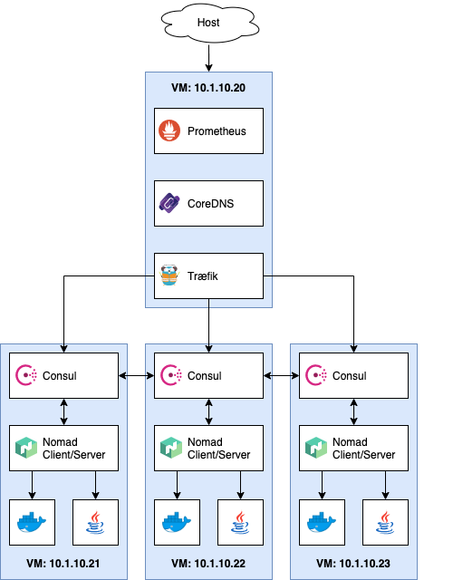

# Nomad Demo

Kubernetes is ubiquitous and an excellent platform, especially if you use the integrated offers of the big cloud providers like Amazon Web Services, Google Cloud or Microsoft Azure. But installing it on-premise can be quite a challenge: Many new concepts and abstraction layers need to be understood and managed in production, including several options for software defined networking and storage adapters.

Smaller administration teams in particular are often not immediately up to this challenge, and the volume of software and services deployed in the end does not always justify such complexity.

It may be worth considering alternatives, especially if not only containers are to be managed centrally, but also other traditional workloads such as Java applications or VMs.

This demo project uses both Consul and Nomad from Hashicorp:

 
Consul is a service networking solution to connect services across any runtime platform. Service registry, integrated health checks, and DNS and HTTP interfaces enable any service to discover and be discovered by other services.<br clear="both"><br>

 Nomad is a workload orchestrator that deploys and manages containers and non-containerized applications at scale. It addresses the technical complexity of workload orchestration across the cloud, on-prem, and hybrid infrastructure.


## Overview



[Traefik](https://docs.traefik.io/): Load balancer using Consul Catalog service discovery. All services registered in Consul will be exposed as `<service name>.demo`. In context of this demo setup, you'll have to adjust your `/etc/hosts` file accordingly ([see below](#user-content-etc-hosts)).

[CoreDNS](http://coredns.io/): Provides name resolution for the `consul.` root domain and forwards DNS queries to either the local `*.consul.` zone or Cloudflare 1.1.1.1 as upstream DNS.

[Prometheus](https://prometheus.io/): Collects basic metrics form Traefik, Consul (via [consul_exporter](https://github.com/prometheus/consul_exporter/)) and applications tagged with `prometheus`.

All three nodes run [Consul](https://consul.io/) and [Nomad](https://nomadproject.io/), the latter configured both as server (= control plane) and client (= node running the actual workload). With Docker and a Java Runtime Environment installed, Nomad can run containerized workloads and jar files.

An example deployment configuration for each is included in this setup.

<br clear="both"><br>

```diff
-      **** REMEMBER, THIS IS JUST A DEMO SET UP AND IN NO WAY INTENDED TO RUN IN PRODUCTION! ****     -
```


## Setup

### Prerequisites

You need three components to get the setup running:

1. [VirtualBox](https://www.virtualbox.org/wiki/Downloads)
2. [Vagrant](https://www.vagrantup.com/downloads.html) <sup id="a1">[1](#f1)</sup>
3. [Ansible](https://docs.ansible.com/ansible/latest/installation_guide/intro_installation.html)

If you're working on macOS and have [Homebrew](https://brew.sh/) installed, you can setup everything with two commands:

```sh
brew cask install vagrant virtualbox
brew install ansible
```

Also your host system needs at least 4GB of RAM available and about 14GB of free hard disk (sorry, Vagrant VM boxes 🤷‍♂️).


### Installation

1. **Clone this Git repository:**

   ```sh
   git clone --depth=1 https://github.com/fhemberger/nomad-demo.git
   cd nomad-demo
   ```

2. **Create and provision virtual machines with Vagrant:**  
   This will create four virtual machines with IPs _10.1.10.20–23_. If your local network already uses this address range, you can define an alternate range in the `Vagrantfile` before continuing with the installation:

   ```sh
   vagrant up --no-provision
   vagrant provision

   # If you want to try the included Java demo, you also need to run:
   ansible-playbook playbook.yml
   ```

3. <strong id="etc-hosts">Configure host names for all services:</strong>  
   On your machine, add the following lines to your `/etc/hosts`. If you changed the IP range before in your `Vagrantfile`, make sure to adjust it here as well:

   ```
   10.1.10.20 traefik.demo
   10.1.10.20 consul.demo
   10.1.10.20 nomad.demo
   10.1.10.20 prometheus.demo
   10.1.10.20 hello-docker.demo
   10.1.10.20 hello-java.demo
   10.1.10.20 jar-server.demo
   ```

To check if everything is working correctly, go to http://traefik.demo, you should see the UI of the load balancer with a list of registered services:

<a href=".images/screenshot-traefik01.png"></a>
<a href=".images/screenshot-traefik02.png"></a>

<br clear="both"><br>

Sites that are available from the start:

- http://traefik.demo - Load balancer UI, see all registered services
- http://consul.demo - Consul UI
- http://nomad.demo - Nomad UI
- http://prometheus.demo - Prometheus metrics UI


## Working with Nomad

### Deploying jobs

Two example applications are included with this demo: [`hello-world-docker.nomad`](roles/nomad/templates/jobs/hello-world-docker.nomad) and [`hello-world-java.nomad`](roles/nomad/templates/jobs/hello-world-java.nomad)<sup id="a2">[2](#f2)</sup>. Go to http://nomad.demo/ui/jobs/run, copy and paste one of the jobs into the editor and click "Plan".

Nomad performs a syntax check by dry-running the job on the scheduler without applying the changes yet. If you change settings in your job file later on, this step will also show a diff of all the changes (e.g. number of instances):


Click "Run" to deploy the job to the Nomad cluster.

If you prefer to run the demos from the command line you can use `vagrant ssh` to execute the command on the VM. As the files are copied to all instances, the node number doesn't matter in this case:

```sh
vagrant ssh consul-nomad-node1 -c 'nomad job run ~/jar-server.nomad'
```

#### Collecting application metrics with Prometheus

The load balancer also includes a [Prometheus](https://prometheus.io/) instance, which also uses Consul for service discovery. If your application's Nomad job is tagged with `prometheus` and has a metrics endpoint under `/metrics`, it will be scraped automatically and appear in the Prometheus target overview under http://prometheus.demo.


### Stopping jobs

Go to the [Job overview page](http://nomad.demo/ui/jobs), select a job, click "Stop" and confirm. Stopped jobs don't disappear immediately but remain in the "Dead" state until the garbage collection removes them completely.

### Removing dead/completed jobs

Dead/completed jobs are cleaned up in accordance to the garbage collection interval (default: `1h`). You can force garbage collection using the System API endpoint which will run the global garbage collector:

```sh
vagrant ssh consul-nomad-node1

# Inside the VM:
curl -X PUT http://localhost:4646/v1/system/gc
```

If you wish to lower the GC interval permanently for jobs, you can use the [`job_gc_threshold`](https://www.nomadproject.io/docs/agent/configuration/server.html#job_gc_threshold) configuration parameter within the server config stanza.


## Taking it further

Dive deeper into the [Job specification](https://nomadproject.io/docs/job-specification/): learn about the [`template`](https://nomadproject.io/docs/job-specification/template/) and [`volume`](https://nomadproject.io/docs/job-specification/volume/) stanza to add storage to your jobs. Starting 0.11 beta, Nomad also supports [Container Storage Interface (CSI)](https://www.hashicorp.com/blog/hashicorp-nomad-container-storage-interface-csi-beta/).

You can launch jobs that claim storage volumes from AWS Elastic Block Storage (EBS) or Elastic File System (EFS) volumes, GCP persistent disks, Digital Ocean droplet storage volumes, Ceph, vSphere, or vendor-agnostic third-party providers like Portworx. This means that the same plugins written by storage providers to support Kubernetes also support Nomad out of the box.


## On Security

For this demo I tried to keep the setup simple, but already a bit closer to a practical use than "just start it in development mode on your laptop". I think that it provides a good, stable basis which can be extended (especially through Ansible) if the following security considerations are taken into account:

- Separate the control plane from the worker pool running the applications, so faulty or malicious workloads have less impact on the overall system integrity and stability. Three nodes running a Consul and Nomad server are required to run in high availability (HA) mode. This allows Consul to reach a quorum, even in one node should go down. Each worker node however should run a Consul and Nomad Client, with the Nomad client talking to the Consul client and the Consul client talking to the Consul server.

- Access Control Lists (ACLs) are indispensable to secure UI, API, CLI, service and agent communications on both [Consul](https://www.consul.io/docs/acl/index.html) and [Nomad](https://learn.hashicorp.com/nomad/acls/fundamentals). 

- Apply thorough network security measures (firewall, isolation, etc.) both from the outside and in between the machines.

- Whatever workloads you run, please familiarize yourself with the appropriate security measures and implement them on all machines (and no, just putting applications into containers does not automatically make them secure).

- Make all web-services only available via HTTPS. Traefik offers great support for [automatic certificate management with Let's Encrypt](https://docs.traefik.io/https/acme/), for example.


## Contributing

Contributions and bug fixes are always welcome!


## License

[MIT](LICENSE)

---

<sup id="f1">1</sup> Deployment is also possible _without_ Vagrant if the VMs are provided elsewhere. All you need is an Ansible inventory file in the following format:

```
loadbalancer           ansible_host=your.vm.ip.address

[consul_nomad]
consul-nomad-node1     ansible_host=your.vm.ip.address
...
consul-nomad-nodeN     ansible_host=your.vm.ip.address
```

Afterwards run the provisioning step with `ansible-playbook -i <inventory file> playbook.yml` [↩](#user-content-a1)

---

<sup id="f2">2</sup> To get the Java demo up and running, I had to provide a Jar file and the opportunity for Nomad to download it. So I decided to use [this "Hello World" app](https://github.com/bjrbhre/hello-http-java), compile it in a Dockerfile and use a static web server for downloads. This server also includes a "metrics" text file to fake a scraping endpoint for [Prometheus](#collecting-application-metrics-with-prometheus). [↩](#user-content-a2)
