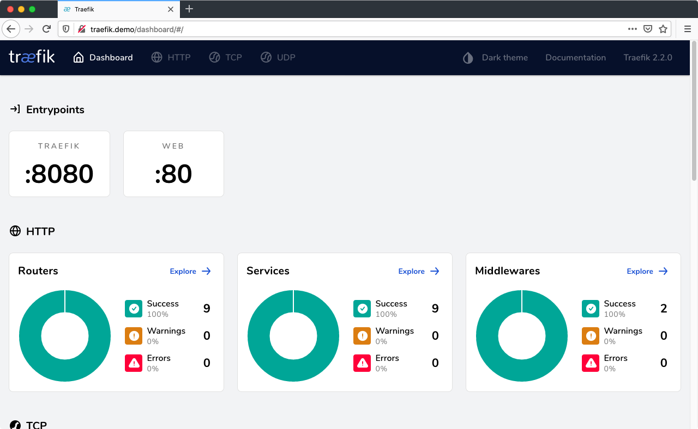
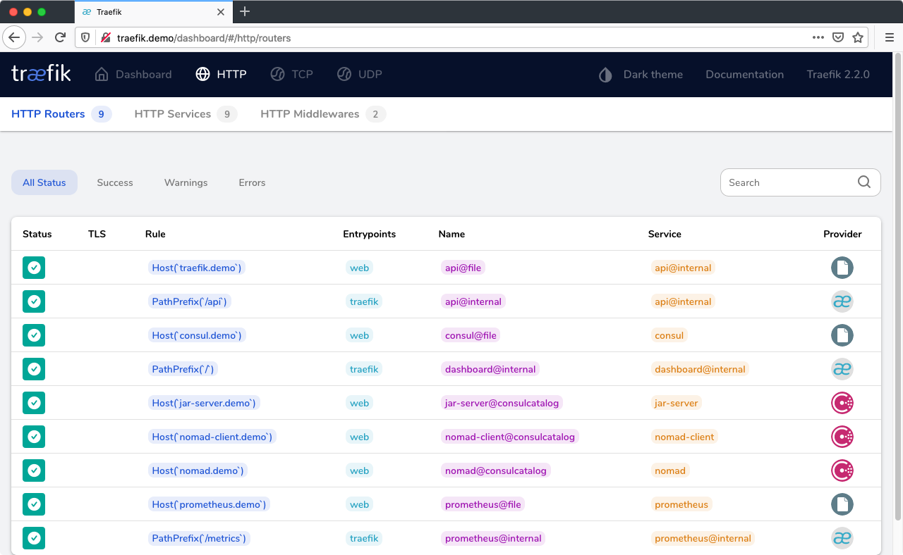
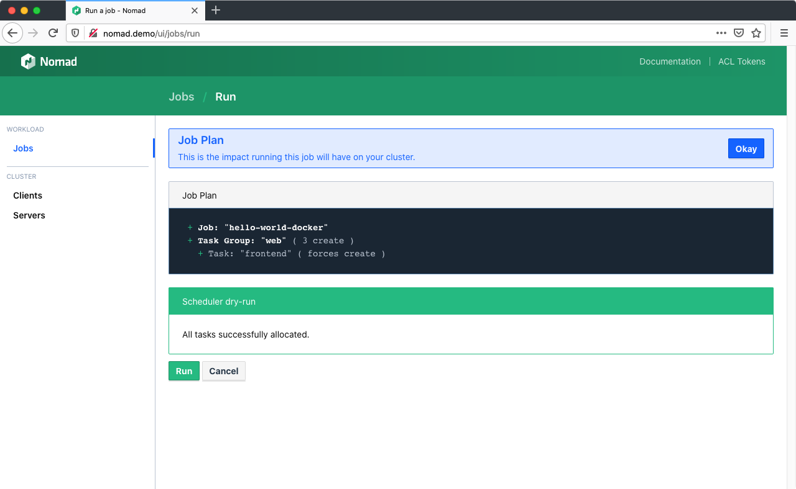
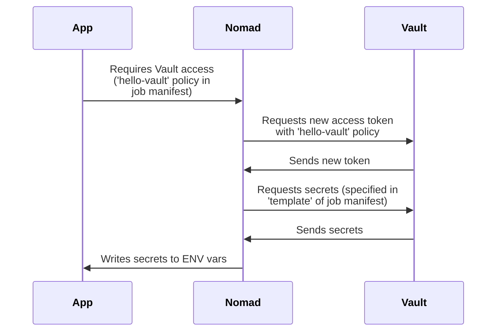

# Nomad Demo

Kubernetes is ubiquitous and an excellent platform, especially if you use the integrated offers of the big cloud providers like Amazon Web Services, Google Cloud or Microsoft Azure. But installing it on-premise can be quite a challenge: Many new concepts and abstraction layers need to be understood and managed in production, including several options for software defined networking and storage adapters.

Smaller administration teams in particular are often not immediately up to this challenge, and the volume of software and services deployed in the end does not always justify such complexity.

It may be worth considering alternatives, especially if not only containers are to be managed centrally, but also other traditional workloads such as Java applications or VMs.

This demo project uses Consul, Nomad and Vault from HashiCorp:

 
Consul is a service networking solution to connect services across any runtime platform. Service registry, integrated health checks, and DNS and HTTP interfaces enable any service to discover and be discovered by other services.<br clear="both"><br>

 Nomad is a workload orchestrator that deploys and manages containers and non-containerized applications at scale. It addresses the technical complexity of workload orchestration across the cloud, on-prem, and hybrid infrastructure.

 Vault allows you to store, access, and deploy secrets across applications, systems, and infrastructure. Vault centrally manages and enforces access to secrets and systems based on trusted sources of application and user identity.


## Overview


[Traefik](https://docs.traefik.io/): Load balancer using Consul Catalog service discovery. All services registered in Consul with the tag `http` will be exposed as `<service name>.demo`. In context of this demo setup, you'll have to adjust your `/etc/hosts` file accordingly ([see below](#user-content-etc-hosts)).

[CoreDNS](http://coredns.io/): Provides name resolution for the `consul.` root domain and forwards DNS queries to either the local `*.consul.` zone or Cloudflare 1.1.1.1 as upstream DNS.

[Prometheus](https://prometheus.io/): Collects basic metrics form Traefik, Consul (via [consul_exporter](https://github.com/prometheus/consul_exporter/)), Nomad and applications tagged with `prometheus`.

All three nodes run [Consul](https://consul.io/), [Nomad](https://nomadproject.io/) and [Vault](https://www.vaultproject.io/), with Nomad configured both as server (= control plane) and client (= node running the actual workload). As both Docker and a Java Runtime Environment is installed, Nomad can run containerized workloads and jar files.

An example deployment configuration for each is included in this setup.

<br clear="both"><br>

```
🚨 REMEMBER, THIS IS JUST A DEMO SET UP AND IN NO WAY INTENDED TO RUN IN PRODUCTION! 🚨
```


## Setup

### Prerequisites

You need three components to get the setup running:

1. [VirtualBox](https://www.virtualbox.org/wiki/Downloads)
2. [Vagrant](https://www.vagrantup.com/downloads.html) <sup id="a1">[1](#f1)</sup>
3. [Ansible](https://docs.ansible.com/ansible/latest/installation_guide/intro_installation.html)

If you're working on macOS and have [Homebrew](https://brew.sh/) installed, you can setup everything with two commands:

```sh
brew cask install vagrant virtualbox
brew install ansible
```

Your host system will need at least 6GB of RAM and about 20GB of free hard disk (sorry, Vagrant VM boxes 🤷‍♂️).

Although the Vagrant boxes are running Ubuntu LTS, Debian should work just as fine (PRs gladly accepted for RedHat Linux). The setup supports both Intel (`x86_64`/`amd64`) and ARM (`arm64`) architectures.

### Installation

1. **Clone this Git repository:**

   ```sh
   git clone --depth=1 https://github.com/fhemberger/nomad-demo.git
   cd nomad-demo
   ```

2. **Create and provision virtual machines with Vagrant:**  
   Vagrant will create four virtual machines with IPs _192.168.56.20–23_. This is the default IP range in VirtualBox. If your local network already uses this address range, you can define an alternate range in the `Vagrantfile` before continuing with the installation.

   As there are some logical dependencies in the setup, it is split up in multiple parts:

     1. Create the four VMs in VirtualBox with Vagrant
     2. Setup the Consul cluster and elect a leader
     3. Setup Vault (which requires the working Consul cluster),  
        Nomad (which in turn requires a token from Vault) and the load balancer VM.
     4. Deploy the provided demo jobs on Nomad

     <br>

   ```sh
   make
   make run-jobs

   # You can run `make help` to get a list of all available tasks.
   ```

3. <strong id="etc-hosts">Configure host names for all services:</strong>  
   Add the following lines to `/etc/hosts` on your machine. If you changed the IP range before in your `Vagrantfile`, make sure to adjust it here as well:

   ```
   192.168.56.20 traefik.demo
   192.168.56.20 consul.demo
   192.168.56.20 nomad.demo
   192.168.56.20 vault.demo
   192.168.56.20 grafana.demo
   192.168.56.20 prometheus.demo
   192.168.56.20 alertmanager.demo
   192.168.56.20 hello-docker.demo
   192.168.56.20 hello-java.demo
   192.168.56.20 hello-vault.demo
   ```

To check if everything is working correctly, go to http://traefik.demo, you should see the UI of the load balancer with a list of registered services:

<a href=".images/screenshot-traefik01.png"></a>
<a href=".images/screenshot-traefik02.png"></a>

<br clear="both"><br>

Sites available after installation:

- http://traefik.demo - Load balancer UI, see all registered services
- http://consul.demo - Consul UI
- http://nomad.demo - Nomad UI
- http://vault.demo - Vault UI
- http://grafana.demo - Grafana Dashboards
- http://prometheus.demo - Prometheus metrics UI
- http://alertmanager.demo - Prometheus Alertmanager UI

### Removing all demo resources

Run `make clean` to shut down and delete all created VMs. Afterwards remove the demo host names from `/etc/hosts`.


## Working with Nomad

### Deploying jobs

If you followed step 2 above, Prometheus, Grafana and the demo jobs will already be running on Nomad.

If you want to edit those jobs or deploy one of your own, there are two ways to do so:

#### Running jobs from the UI

Three example applications are included with this demo: [`hello-world-docker.nomad`](nomad_jobs/hello-world-docker.nomad), [`hello-world-java.nomad`](nomad_jobs/hello-world-java.nomad) and [`hello-world-vault.nomad`](nomad_jobs/hello-world-vault.nomad). Go to http://nomad.demo/ui/jobs/run, copy and paste one of the jobs into the editor and click "Plan".

Nomad performs a syntax check by dry-running the job on the scheduler without applying the changes yet. If you change settings in your job file later on, this step will also show a diff of all the changes (e.g. number of instances):



Click "Run" to deploy the job to the Nomad cluster.

#### Running jobs using the CLI

If you prefer to run the demos from the command line, you can use `vagrant ssh` to login to one of the nodes and the `nomad` CLI command to deploy them directly from the VM. The three example jobs are copied to the vagrant user's home directory on all instances, the node number doesn't matter, e.g.:

```sh
vagrant ssh consul-nomad-node1

# Inside the VM
nomad job run ~/nomad_jobs/hello-world-docker.nomad
```

### Stopping jobs

Go to the [Job overview page](http://nomad.demo/ui/jobs), select a job, click "Stop" and confirm. Stopped jobs don't disappear immediately but remain in the "Dead" state until the garbage collection removes them completely.

### Removing dead/completed jobs

Dead/completed jobs are cleaned up in accordance to the garbage collection interval (default: `1h`). You can force garbage collection using the System API endpoint which will run the global garbage collector:

```sh
vagrant ssh consul-nomad-node1 -c 'curl -X PUT http://localhost:4646/v1/system/gc'
```

If you wish to lower the GC interval permanently for jobs, you can use the [`job_gc_threshold`](https://www.nomadproject.io/docs/agent/configuration/server.html#job_gc_threshold) configuration parameter within Nomad's [server config stanza](https://github.com/fhemberger/nomad-demo/blob/master/roles/nomad/templates/nomad.hcl.j2#L27).


## What is Vault?

Vault is the Swiss Army knife for managing secrets and access rights across your entire platform, e.g.:

- Store arbitrary passwords, API keys, etc. for your applications in the [key/value store](https://www.vaultproject.io/docs/secrets/kv).
- Create custom, short lived credentials for [databases](https://www.vaultproject.io/docs/secrets/databases) and rotate root passwords regularly.
- Generate dynamic API tokens for [Consul](https://www.vaultproject.io/docs/secrets/consul) and [Nomad](https://www.vaultproject.io/docs/secrets/nomad).
- Create [X.509 certificates](https://www.vaultproject.io/docs/secrets/pki) and manage the [SSH access](https://www.vaultproject.io/docs/secrets/ssh/signed-ssh-certificates) to your machines.
- Manage access to your cloud environment ([AWS](https://www.vaultproject.io/docs/secrets/aws), [Azure](https://www.vaultproject.io/docs/secrets/azure), [Google Cloud](https://www.vaultproject.io/docs/secrets/gcp), etc.) for users and applications.
- Authenticate users through [LDAP](https://www.vaultproject.io/docs/auth/ldap), [username/password](https://www.vaultproject.io/docs/auth/userpass), [GitHub](https://www.vaultproject.io/docs/auth/github), [Okta](https://www.vaultproject.io/docs/auth/okta), etc.

And all this with granular access control and full audit trail.


### Working with Vault

> This Vault integration is based on a [blog post](https://medium.com/hashicorp-engineering/nomad-integration-with-vault-42b0e5feca78) by Patrick Gryzan from HashiCorp.

The process of [initializing](https://www.vaultproject.io/docs/commands/operator/init) and [unsealing](https://www.vaultproject.io/docs/commands/operator/unseal) vault are already automated in Ansible for this demo, however you should familiarize yourself with the concept:

> When a Vault server is started, it starts in a *sealed* state. In this state, Vault is configured to know where and how to access the physical storage, but doesn't know how to decrypt any of it.
> 
> *Unsealing* is the process of constructing the master key necessary to read the decryption key to decrypt the data, allowing access to the Vault.

– [»Concepts: Seal/Unseal«](https://www.vaultproject.io/docs/concepts/seal) (from the Vault documentation)

Whenever you stop the Vault service on the server or shut down the VM, the node will be sealed again, making sure your encrypted data is always safe.
The Consul dashboard will show a failed service check for that particular Vault node.

To unseal Vault again, run the following Ansible playbook:

```sh
ansible-playbook \
  -i .vagrant/provisioners/ansible/inventory/vagrant_ansible_inventory \
  unseal-vault.yml
```

The keys for unsealing and the user tokens to access Vault are stored under `credentials`. 

#### Workflow for requesting secrets from Vault in your app




## Collecting application metrics with Prometheus

This setup also includes a [Prometheus](https://prometheus.io/) instance, which uses Consul for service discovery. If your application's Nomad job is tagged with `prometheus` and has a metrics endpoint under `/metrics`, it will be scraped automatically and appear in the Prometheus target overview under http://prometheus.demo.


## Grafana Dashboards

There are some basic dashboards for Consul, Nomad and Traefik available under http://grafana.demo. Username/password is `admin`.


## Taking it further

Dive deeper into the [Job specification](https://nomadproject.io/docs/job-specification/): learn about the [`artifact`](https://nomadproject.io/docs/job-specification/artifact/), [`template`](https://nomadproject.io/docs/job-specification/template/) and [`volume`](https://nomadproject.io/docs/job-specification/volume/) stanzas to add config files and storage to your jobs. Starting 0.11 beta, Nomad also supports [Container Storage Interface (CSI)](https://www.hashicorp.com/blog/hashicorp-nomad-container-storage-interface-csi-beta/).

You can launch jobs that claim storage volumes from AWS Elastic Block Storage (EBS) or Elastic File System (EFS) volumes, GCP persistent disks, Digital Ocean droplet storage volumes, Ceph, vSphere, or vendor-agnostic third-party providers like Portworx. This means that the same plugins written by storage providers to support Kubernetes also support Nomad out of the box.


## On Security

For this demo I tried to keep the setup simple, but already a bit closer to a practical use than "just start it in development mode on your laptop". I think that it provides a good, stable basis which can be extended (especially through Ansible) if the following security considerations are taken into account:

- Separate the control plane from the worker pool running the applications, so faulty or malicious workloads have less impact on the overall system integrity and stability. Three nodes running a Consul and Nomad server are required to run in high availability (HA) mode. This allows Consul to reach a quorum, even in one node should go down. Each worker node however should run a Consul and Nomad Client, with the Nomad client talking to the Consul client and the Consul client talking to the Consul server.

- Access Control Lists (ACLs) are indispensable to secure UI, API, CLI, service and agent communications on [Consul](https://www.consul.io/docs/acl/index.html), [Nomad](https://learn.hashicorp.com/nomad/acls/fundamentals) and [Vault](https://www.vaultproject.io/docs/concepts/policies). 

- Apply thorough network security measures (firewall, isolation, etc.) both from the outside and in between the machines.

- Whatever workloads you run, please familiarize yourself with the appropriate security measures and implement them on all machines (and no, just putting applications into containers does not automatically make them secure).

- Make all web-services only available via HTTPS. Traefik offers great support for [automatic certificate management with Let's Encrypt](https://docs.traefik.io/https/acme/), for example.

- Monitor [Vault's audit log](https://www.vaultproject.io/docs/audit). All Vault API requests (internal and external) are logged to detect if someone tries to gain access to your secrets or tamper with them. This demo uses the `syslog` audit backend to send those logs to the `loadbalancer`, in lack of a different VM – **In production of course, audit logs *never* belong on an outside facing machine!**
  
  They are stored in `/var/log/vault/audit.log` and the file is rotated daily. However, it is better to send them to [Elasticsearch](https://www.elastic.co/elasticsearch/) for example and have them analyzed with [Kibana](https://www.elastic.co/elasticsearch/).


## Contributing

Contributions and bug fixes are always welcome!


## License

[MIT](LICENSE)

---

<sup id="f1">1</sup> Deployment is also possible _without_ Vagrant if the VMs are provided by other means. All you need is an Ansible inventory file in the following format:

```
loadbalancer           ansible_host=your.vm.ip.address

[consul_nomad]
consul-nomad-node1     ansible_host=your.vm.ip.address
...
consul-nomad-nodeN     ansible_host=your.vm.ip.address
```

Afterwards run the provisioning step with `ansible-playbook -i <inventory file> playbook.yml` [↩](#user-content-a1)
